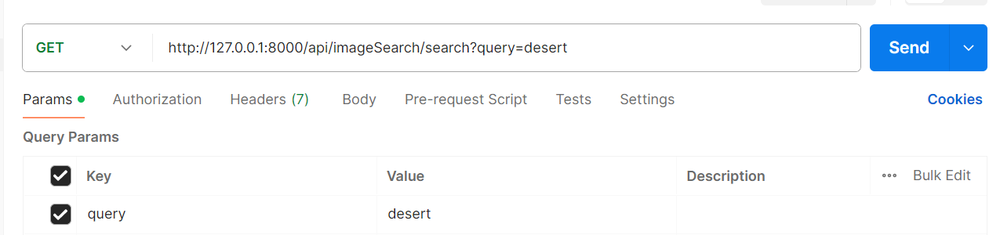

# 📄 Image Search API

The **Image Search API** allows you to perform intelligent and efficient search across a collection of images using **natural language queries**. It leverages modern CV and NLP techniques to return the most relevant results, making image retrieval smarter and more intuitive.

---

## 🚀 Features

- 🔍 Natural language search across multiple images  
- 📁 Search endpoint to retrieve top-matching images  
- ⚡ Fast, lightweight API powered by FastAPI and Uvicorn  

---

## 📦 Installation & Setup

Follow these steps to set up and run the API locally:

### 1. Clone the Repository

```
git clone https://github.com/mohdsaqibhbi/Image_Search.git
cd Image_Search
```

### 2. Without Docker

#### 1. Create and Activate a Conda Environment

```
conda create -n <env_name> python=3.10 -y
conda activate <env_name>
```

#### 2. Install Dependencies
```
pip install -r requirements.txt
```

#### 3. Setup the config file `config.json`
```
{
    "model": {
        "modelname": "openai/clip-vit-base-patch32"
    },
    "data": {
        "data_location": "../../data/images"
    },
    "database": {
        "faiss_index_location": "schema/database/faiss_index.bin",
        "image_mapping_location": "schema/database/image_mapping.pkl"
    }
}
```

#### 4. Start the API
```
uvicorn api:app
```

### 3. With Docker

#### 1. Setup the config file `config.json`
```
{
    "model": {
        "modelname": "openai/clip-vit-base-patch32"
    },
    "data": {
        "data_location": "/home/azureuser/cloudfiles/code/Users/mohd.saqib/Others/Image_Search/data/images"
    },
    "database": {
        "faiss_index_location": "schema/database/faiss_index.bin",
        "image_mapping_location": "schema/database/image_mapping.pkl"
    }
}
```
#### 2. Update `data_location` path in `docker-compose.yml` file

```
volumes:
      - /home/azureuser/cloudfiles/code/Users/mohd.saqib/Others/Image_Search/data:/home/azureuser/cloudfiles/code/Users/mohd.saqib/Others/Image_Search/data
```

#### 3. Run docker container

```docker compose up```

## 🔌 API Endpoints

### `/search`

- **Method:** `GET`
- **Description:** Returns the list of images that best match the given natural language query.
- **Query Parameter:**
  - `query` (str): The search term or phrase.

### `/health`

- **Method:** `GET`
- **Description:** Simple health check endpoint to verify that the API is running.

## 🔗 Usage

You can test the search endpoint by sending a GET request using:

### Postman


### Browser
Put this into the brower and hit **Enter**.
```
http://127.0.0.1:8000/api/imageSearch/search?query=desert
```

### curl
```
curl -X GET "http://127.0.0.1:8000/api/imageSearch/search?query=desert"
```